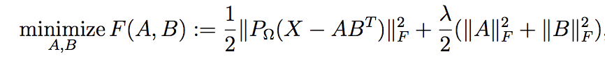
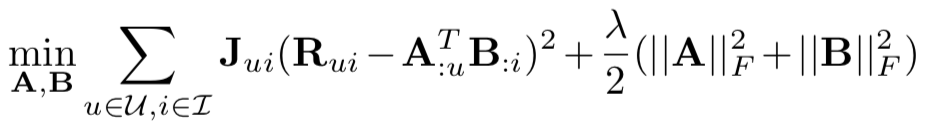
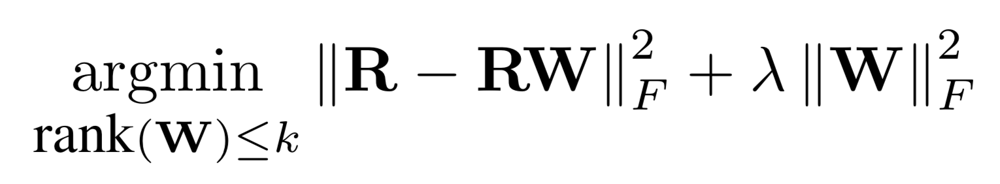
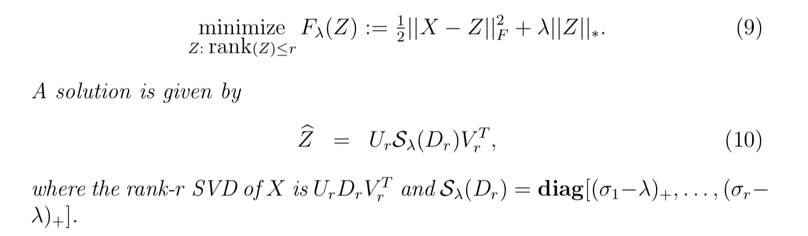
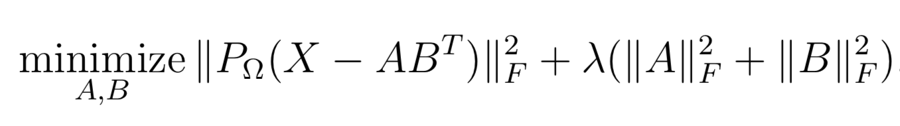
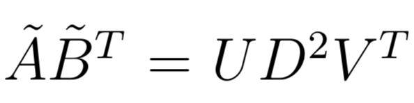

# reco

`reco` is an R package which implements many algorithms for **sparse matrix factorizations**. Focus is on applications for **recommender systems**.

## Algorithms

### Classification/Regression

1. [Follow the proximally-regularized leader](http://www.jmlr.org/proceedings/papers/v15/mcmahan11b/mcmahan11b.pdf) which llows to solve **very large linear/logistic regression** problems with elastic-net penalty. Solver use with stochastic gradient descend with adaptive learning rates (so can be used for online learning - not necessary to load all data to RAM). See [Ad Click Prediction: a View from the Trenches](https://www.eecs.tufts.edu/~dsculley/papers/ad-click-prediction.pdf) for more examples.
    - Only logistic regerssion implemented at the moment
    - Core input format for matrix is CSR - `Matrix::RsparseMatrix`. Hoewer common R `Matrix::CpasrseMatrix` ( aka `dgCMatrix`) will be converted automatically

### Matrix Factorizations

1. Vanilla **Maximum Margin Matrix Factorization** - classic approch for "rating" prediction. See `WRMF` class and constructor option `feedback = "explicit"`. Original paper which indroduced MMMF could be found [here](http://ttic.uchicago.edu/~nati/Publications/MMMFnips04.pdf).
    * 
1. **Weighted Regularized Matrix Factorization (WRMF)** from [Collaborative Filtering for Implicit Feedback Datasets](http://yifanhu.net/PUB/cf.pdf). See `WRMF` class and constructor option `feedback = "implicit"`. 
We provide 2 solvers:
    1. Exact based of Cholesky Factorization
    1. Approximated based on fixed number of steps of **Conjugate Gradient**.
See details in [Applications of the Conjugate Gradient Method for Implicit Feedback Collaborative Filtering](https://pdfs.semanticscholar.org/bfdf/7af6cf7fd7bb5e6b6db5bbd91be11597eaf0.pdf) and [Faster Implicit Matrix Factorization](www.benfrederickson.com/fast-implicit-matrix-factorization/).
    * 
1. **Linear-Flow** from [Practical Linear Models for Large-Scale One-Class Collaborative Filtering](http://www.bkveton.com/docs/ijcai2016.pdf). Algorithm looks for factorized low-rank item-item similarity matrix (in some sense it is similar to [SLIM](http://glaros.dtc.umn.edu/gkhome/node/774))
    * 
1. Fast **Truncated SVD** and **Truncated Soft-SVD** via Alternating Least Squares as described in [Matrix Completion and Low-Rank SVD via Fast Alternating Least Squares](https://arxiv.org/pdf/1410.2596.pdf). Work nice for sparse and dense matrices. Usually it is even faster than [irlba](https://github.com/bwlewis/irlba) package.
    * 
1. **Soft-Impute** via fast Alternating Least Squares as described in [Matrix Completion and Low-Rank SVD via Fast Alternating Least Squares](https://arxiv.org/pdf/1410.2596.pdf).
    * 
    * with a solution in SVD form 

## Efficiency

Package is reasonably fast and scales nicely to datasets with millions of rows and millions of columns:

* built on top of `RcppArmadillo`
* extensively uses **BLAS** and parallelized with **OpenMP**

Here is example of `reco::WRMF` on [lastfm360k](https://www.upf.edu/web/mtg/lastfm360k) dataset in comparison with other good implementations:

# Materials

**Note that syntax could be not up to date since package is under active development**

1. [Slides from DataFest Tbilisi(2017-11-16)](https://www.slideshare.net/DmitriySelivanov/matrix-factorizations-for-recommender-systems)
1. [Introduction to matrix factorization with Weighted-ALS algorithm](http://dsnotes.com/post/2017-05-28-matrix-factorization-for-recommender-systems/) - collaborative filtering for implicit feedback datasets.
1. [Music recommendations using LastFM-360K dataset](http://dsnotes.com/post/2017-06-28-matrix-factorization-for-recommender-systems-part-2/)
    * evaluation metrics for ranking
    * setting up proper cross-validation
    * possible issues with nested parallelism and thread contention
    * making recommendations for new users
    * complimentary item-to-item recommendations
1. [Benchmark](http://dsnotes.com/post/2017-07-10-bench-wrmf/) against other good implementations

# API

We follow [mlapi](https://github.com/dselivanov/mlapi) conventions.

### Notes on multithreading and BLAS

If you use multithreaded BLAS (you generally should) such as OpenBLAS, Intel MKL, Apple Accelerate, it is recommended to disable its internal multithreading ability (since thread contention can be easily slow down 10x and more). Matrix factorization is already parallelized in package with OpenMP.

At the moment `reco` tries to  mitigate this issue automatically with the help of [RhpcBLASctl](https://cran.r-project.org/web/packages/RhpcBLASctl/index.html). If you encounter any issues - please report to our [issue tracker]
